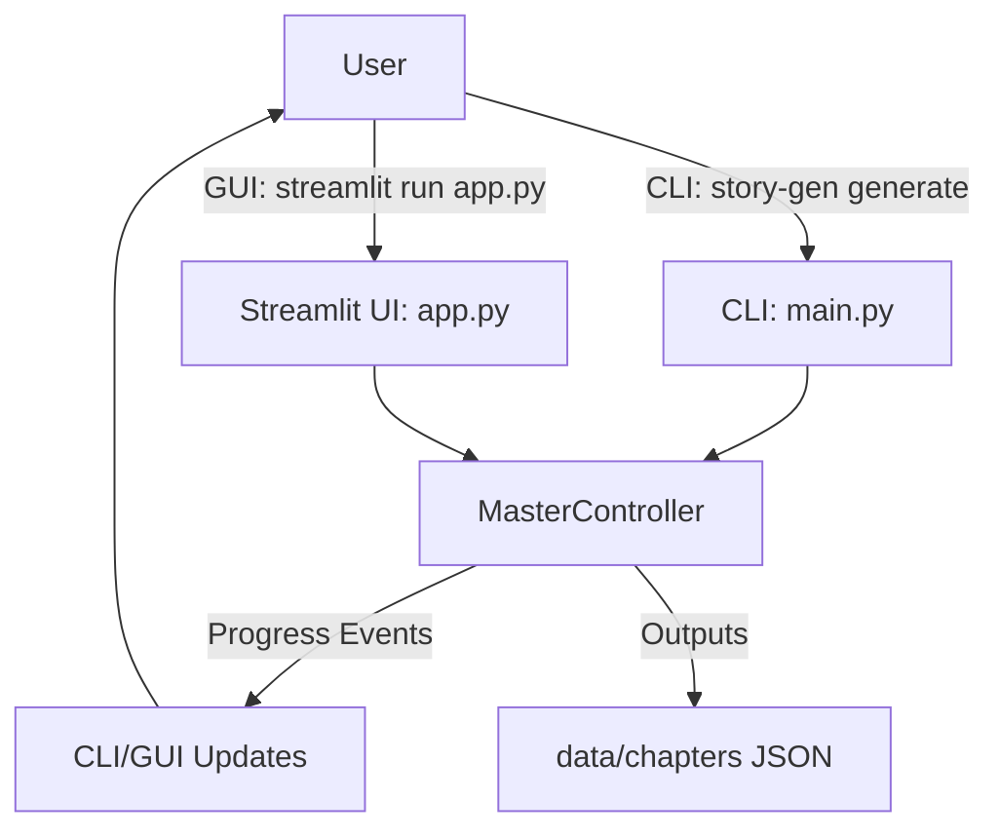
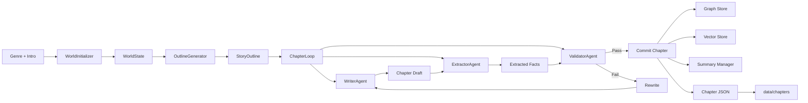
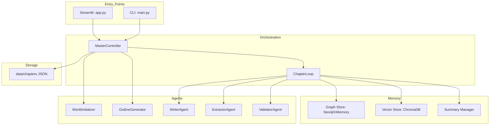

# Project Architecture — Narrative Consistency Engine

## Overview
This project generates long-form, multi-chapter stories with consistency checks. It combines:
- A CLI runner (Typer)
- A Streamlit GUI
- An orchestration layer that coordinates agents
- Memory systems (Neo4j or in-memory graph + Chroma vector store + rolling summaries)

## User Workflow (Diagram)


## Data Workflow (Diagram)


## Architecture (Diagram)


## System Design (Diagram)
```mermaid
sequenceDiagram
    actor User
    participant UI as CLI/GUI
    participant MC as MasterController
    participant WI as WorldInitializer
    participant OG as OutlineGenerator
    participant Loop as ChapterLoop
    participant WA as WriterAgent
    participant EA as ExtractorAgent
    participant VA as ValidatorAgent
    participant GS as Graph Store
    participant VS as Vector Store
    participant SM as Summary Manager
    participant FS as data/chapters

    User->>UI: Provide genre + intro + chapter count
    UI->>MC: run(genre, intro)
    MC->>WI: initialize()
    WI-->>MC: WorldState
    MC->>OG: generate(WorldState)
    OG-->>MC: StoryOutline

    loop per chapter
        MC->>Loop: run(chapter_num, state)
        Loop->>WA: write()/rewrite()
        WA-->>Loop: draft
        Loop->>EA: extract(draft)
        EA-->>Loop: facts
        Loop->>VA: validate(draft, facts)
        VA-->>Loop: score + violations
        Loop->>GS: apply_facts(facts)
        Loop->>VS: add_chapter(draft)
        Loop->>SM: add_chapter(draft)
        Loop-->>MC: Chapter
        MC->>FS: save chapter + state snapshots
        MC-->>UI: progress events
    end

    MC-->>UI: generation complete
    UI-->>User: show results + saved story
```

## High-Level Flow
1. **World Initialization** → builds world state, rules, and characters
2. **Outline Generation** → creates a 100-chapter outline (5 arcs × 20 chapters)
3. **Convergence Loop** (per chapter): write → extract facts → validate → rewrite if needed → commit
4. **Persistence** → chapter JSON and state snapshots are saved to data/chapters

## Entry Points
- **CLI**: [main.py](main.py)
  - Command: `story-gen generate`
  - Orchestrates generation and prints summary tables
- **GUI**: [app.py](app.py)
  - Streamlit UI for interactive generation, progress, and reading saved stories

## Core Orchestration
- **Master Controller**: [orchestrator/controller.py](orchestrator/controller.py)
  - Owns and wires all agents and memory providers
  - Emits progress events for the CLI/GUI
  - Persists state and chapter outputs

- **Chapter Loop**: [pipelines/chapter_loop.py](pipelines/chapter_loop.py)
  - Runs the convergence loop for each chapter
  - Keeps the best draft across rewrite attempts

## Agents (LLM-Driven)
- **WorldInitializer**: [agents/world_initializer.py](agents/world_initializer.py)
  - Expands genre + premise into a structured world model
- **OutlineGenerator**: [agents/outline_generator.py](agents/outline_generator.py)
  - Creates 100 chapter outlines across 5 arcs
- **WriterAgent**: [agents/writer.py](agents/writer.py)
  - Produces chapter prose with constraints and context
- **ExtractorAgent**: [agents/extractor.py](agents/extractor.py)
  - Extracts state-changing facts as structured data
- **ValidatorAgent**: [agents/validator.py](agents/validator.py)
  - Hard validation (rule/character state) + soft scoring (consistency, logic, tone, outline fit)

## Memory & Knowledge Stores
- **Graph Store**
  - **Neo4jClient**: [memory/neo4j_client.py](memory/neo4j_client.py)
  - **InMemoryGraphStore**: [memory/graph_store.py](memory/graph_store.py)
  - Tracks characters, rules, and events for consistency checks

- **Vector Store**: [memory/vector_store.py](memory/vector_store.py)
  - ChromaDB embeddings for semantic retrieval of past chapters

- **Rolling Summary**: [memory/summary_manager.py](memory/summary_manager.py)
  - Maintains recent chapters in full + older chapters as a compact summary

## Models & Data
- **Pydantic Models**: [models.py](models.py)
  - Canonical types for world, outline, chapters, facts, validation results

- **Generated Outputs**: data/chapters/
  - `*_state_world.json`, `*_state_outline.json`, `*_state_final.json`
  - `*_ch###.json` for each chapter

## LLM Integration
- **Client Wrapper**: [llm_client.py](llm_client.py)
  - Talks to Ollama (JSON and prose modes)
  - Retries JSON responses and extracts valid payloads

## Config & Infrastructure
- **Config**: [configs/config.yaml](configs/config.yaml)
- **Docker**: [infra/docker-compose.yml](infra/docker-compose.yml)
  - Optional Neo4j service

## Runtime Environment
Key environment variables (see .env.example):
- `OLLAMA_HOST`, `OLLAMA_MODEL`
- `NEO4J_URI`, `NEO4J_USER`, `NEO4J_PASSWORD`
- `CHROMA_PERSIST_DIR`
